# 🗄️ DATABASE DESIGN & SCHEMA VISUALIZATION

**Document Version:** 1.0
**Last Updated:** 2025-11-16
**Purpose:** Complete visual reference for VYBE database schema
**Database:** PostgreSQL (via Supabase)

---

## 📋 TABLE OF CONTENTS

1. [Complete Entity Relationship Diagram](#1-complete-entity-relationship-diagram)
2. [Domain-Wise Schema Breakdown](#2-domain-wise-schema-breakdown)
3. [All Models Detailed](#3-all-models-detailed)
4. [All Enumerations](#4-all-enumerations)
5. [Relationships Explained](#5-relationships-explained)
6. [Data Flow Diagrams](#6-data-flow-diagrams)
7. [Index Strategy](#7-index-strategy)
8. [Schema Statistics](#8-schema-statistics)

---

## 1️⃣ COMPLETE ENTITY RELATIONSHIP DIAGRAM

### Complete Schema with All Models and Fields

```mermaid
erDiagram
    User ||--o| StylistProfile : "may have"
    User ||--o{ FCMToken : "has many"
    User ||--o{ Notification : "receives"
    User ||--o{ Wardrobe : "owns"
    User ||--o{ Outfit : "creates"
    User ||--o{ StylingRequest : "makes requests"
    User ||--o{ StylingSession : "client sessions"
    User ||--o{ StylingSession : "stylist sessions"
    User ||--o{ Message : "sends"
    User ||--o{ Review : "gives/receives"
    User ||--o{ Payment : "makes payments"
    User ||--o{ WardrobeShare : "shares/receives wardrobes"
    User ||--o{ OutfitShare : "shares/receives outfits"
    User ||--o{ OutfitSuggestion : "suggests outfits"

    StylistProfile ||--o{ Transaction : "has transactions"
    StylistProfile ||--o{ Withdrawal : "requests withdrawals"

    Wardrobe ||--o{ Category : "has"
    Wardrobe ||--o{ ClothingItem : "contains"
    Wardrobe ||--o{ WardrobeShare : "shared via"
    Wardrobe ||--o{ OutfitSuggestion : "receives suggestions"

    Category ||--o{ Category : "parent-child"
    Category ||--o{ ClothingItem : "categorizes"

    ClothingItem ||--o{ ClothingImage : "has images"
    ClothingItem ||--o{ OutfitItem : "used in outfits"

    Outfit ||--o{ OutfitItem : "contains items"
    Outfit ||--o{ OutfitCalendarEntry : "scheduled in"
    Outfit ||--o{ OutfitShare : "shared via"
    Outfit ||--o{ OutfitSuggestion : "suggested as"

    StylingRequest ||--|| StylingSession : "creates session"

    StylingSession ||--o{ Message : "has messages"
    StylingSession ||--o| Review : "gets review"
    StylingSession ||--o| Payment : "requires payment"

    User {
        string id "PK, UUID"
        string email "Unique, Required"
        string password "Nullable"
        string name "Required"
        string phone "Nullable"
        string bio "Nullable"
        string avatar "Nullable"
        string role "USER or STYLIST"
        boolean emailVerified "Default false"
        string emailVerificationToken "Nullable"
        string passwordResetToken "Nullable"
        datetime passwordResetExpires "Nullable"
        string googleId "Unique, Nullable"
        string appleId "Unique, Nullable"
        int freeSessions "Default 3"
        boolean isActive "Default true"
        datetime createdAt "Auto"
        datetime updatedAt "Auto"
    }

    StylistProfile {
        string id "PK, UUID"
        string userId "FK to User, Unique"
        string bio "Required"
        int yearsOfExperience "Required"
        float pricePerSession "Required"
        string[] languages "Array"
        string[] expertise "Array"
        string[] portfolioImages "Array"
        boolean isAvailable "Default true"
        boolean isVerified "Default true"
        int totalSessions "Default 0"
        float totalEarnings "Default 0"
        float averageRating "Default 0"
        int totalReviews "Default 0"
        float walletBalance "Default 0"
        datetime createdAt "Auto"
        datetime updatedAt "Auto"
    }

    FCMToken {
        string id "PK, UUID"
        string userId "FK to User"
        string token "Unique"
        string deviceId "Nullable"
        datetime createdAt "Auto"
        datetime updatedAt "Auto"
    }

    Notification {
        string id "PK, UUID"
        string userId "FK to User"
        string type "Enum NotificationType"
        string title "Required"
        string message "Required"
        json data "Nullable"
        boolean isRead "Default false"
        datetime createdAt "Auto"
    }

    Wardrobe {
        string id "PK, UUID"
        string userId "FK to User"
        string name "Required"
        string location "Nullable"
        string description "Nullable"
        boolean isDefault "Default false"
        datetime createdAt "Auto"
        datetime updatedAt "Auto"
    }

    Category {
        string id "PK, UUID"
        string wardrobeId "FK to Wardrobe"
        string name "Required"
        string parentId "FK to Category, Nullable"
        int order "Default 0"
        datetime createdAt "Auto"
        datetime updatedAt "Auto"
    }

    ClothingItem {
        string id "PK, UUID"
        string wardrobeId "FK to Wardrobe"
        string categoryId "FK to Category, Nullable"
        string name "Required"
        string itemType "Required"
        string color "Nullable"
        string season "Enum Season"
        string brand "Nullable"
        string notes "Nullable"
        datetime purchaseDate "Nullable"
        float price "Nullable"
        string status "Enum ItemStatus"
        boolean isPrivate "Default false"
        datetime createdAt "Auto"
        datetime updatedAt "Auto"
    }

    ClothingImage {
        string id "PK, UUID"
        string itemId "FK to ClothingItem"
        string url "Required"
        int order "Default 0"
        datetime createdAt "Auto"
    }

    WardrobeShare {
        string id "PK, UUID"
        string wardrobeId "FK to Wardrobe"
        string ownerId "FK to User"
        string sharedWithId "FK to User"
        string permission "Enum SharePermission"
        datetime expiresAt "Nullable"
        datetime createdAt "Auto"
        datetime updatedAt "Auto"
    }

    Outfit {
        string id "PK, UUID"
        string userId "FK to User"
        string name "Required"
        string description "Nullable"
        string season "Enum Season, Nullable"
        string occasion "Nullable"
        string[] tags "Array"
        boolean isFavorite "Default false"
        string previewImage "Nullable"
        datetime createdAt "Auto"
        datetime updatedAt "Auto"
    }

    OutfitItem {
        string id "PK, UUID"
        string outfitId "FK to Outfit"
        string itemId "FK to ClothingItem"
        int order "Default 0"
        datetime createdAt "Auto"
    }

    OutfitCalendarEntry {
        string id "PK, UUID"
        string outfitId "FK to Outfit"
        string userId "FK to User"
        datetime scheduledDate "Unique with userId"
        string notes "Nullable"
        datetime createdAt "Auto"
        datetime updatedAt "Auto"
    }

    OutfitShare {
        string id "PK, UUID"
        string outfitId "FK to Outfit"
        string ownerId "FK to User"
        string sharedWithId "FK to User"
        string permission "Enum SharePermission"
        datetime expiresAt "Nullable"
        datetime createdAt "Auto"
        datetime updatedAt "Auto"
    }

    OutfitSuggestion {
        string id "PK, UUID"
        string wardrobeId "FK to Wardrobe"
        string outfitId "FK to Outfit, Nullable"
        string suggestedById "FK to User"
        boolean isAccepted "Nullable"
        string comment "Nullable"
        datetime createdAt "Auto"
        datetime updatedAt "Auto"
    }

    StylingRequest {
        string id "PK, UUID"
        string userId "FK to User"
        string occasion "Required"
        string timeline "Enum RequestTimeline"
        string requestType "Enum RequestType"
        datetime scheduledStartTime "Nullable"
        datetime scheduledEndTime "Nullable"
        string[] preferredStyles "Array"
        float budget "Nullable"
        string notes "Nullable"
        string status "Enum RequestStatus"
        string matchedStylistId "Nullable"
        datetime expiresAt "Nullable"
        datetime createdAt "Auto"
        datetime updatedAt "Auto"
    }

    StylingSession {
        string id "PK, UUID"
        string requestId "FK to StylingRequest, Unique"
        string userId "FK to User"
        string stylistId "FK to User"
        string status "Enum SessionStatus"
        datetime startedAt "Default now"
        datetime endedAt "Nullable"
        boolean isFreeSession "Default false"
        float amountCharged "Nullable"
        float platformFee "Nullable"
        float stylistEarning "Nullable"
        datetime createdAt "Auto"
        datetime updatedAt "Auto"
    }

    Message {
        string id "PK, UUID"
        string sessionId "FK to StylingSession"
        string senderId "FK to User"
        string content "Required"
        string[] images "Array"
        boolean isRead "Default false"
        datetime createdAt "Auto"
    }

    Review {
        string id "PK, UUID"
        string sessionId "FK to StylingSession, Unique"
        string userId "FK to User"
        string stylistId "FK to User"
        int rating "1-5 stars"
        string comment "Nullable"
        boolean isFlagged "Default false"
        datetime createdAt "Auto"
        datetime updatedAt "Auto"
    }

    Payment {
        string id "PK, UUID"
        string sessionId "FK to StylingSession, Unique"
        string userId "FK to User"
        float amount "Required"
        float platformFee "Required"
        float stylistEarning "Required"
        string razorpayOrderId "Unique"
        string razorpayPaymentId "Unique, Nullable"
        string razorpaySignature "Nullable"
        string status "Enum PaymentStatus"
        datetime createdAt "Auto"
        datetime updatedAt "Auto"
    }

    Transaction {
        string id "PK, UUID"
        string stylistProfileId "FK to StylistProfile"
        string type "Enum TransactionType"
        float amount "Required"
        string description "Required"
        float balanceBefore "Required"
        float balanceAfter "Required"
        datetime createdAt "Auto"
    }

    Withdrawal {
        string id "PK, UUID"
        string stylistProfileId "FK to StylistProfile"
        float amount "Min 500"
        string bankAccountNumber "Required"
        string ifscCode "Required"
        string accountHolderName "Required"
        string status "Enum WithdrawalStatus"
        datetime processedAt "Nullable"
        string failureReason "Nullable"
        datetime createdAt "Auto"
        datetime updatedAt "Auto"
    }
```



---

## 2️⃣ DOMAIN-WISE SCHEMA BREAKDOWN

### 🔵 Domain 1: User Management (4 Models)

```mermaid
erDiagram
    User {
        uuid id PK
        string email UK
        string password
        string name
        string phone
        string bio
        string avatar
        enum role
        boolean emailVerified
        string googleId UK
        string appleId UK
        int freeSessions
        datetime createdAt
        datetime updatedAt
    }

    StylistProfile {
        uuid id PK
        uuid userId FK_UK
        string bio
        int yearsOfExperience
        float pricePerSession
        array languages
        array expertise
        array portfolioImages
        boolean isAvailable
        boolean isVerified
        int totalSessions
        float totalEarnings
        float averageRating
        int totalReviews
        float walletBalance
        datetime createdAt
        datetime updatedAt
    }

    FCMToken {
        uuid id PK
        uuid userId FK
        string token UK
        string deviceId
        datetime createdAt
        datetime updatedAt
    }

    Notification {
        uuid id PK
        uuid userId FK
        enum type
        string title
        string message
        json data
        boolean isRead
        datetime createdAt
    }

    User ||--o| StylistProfile : "has"
    User ||--o{ FCMToken : "has"
    User ||--o{ Notification : "receives"
```

**Purpose:** Authentication, user profiles, stylist profiles, push notifications

**Key Features:**
- Email/password + OAuth (Google, Apple)
- Dual role support (USER can become STYLIST)
- Stylist instant onboarding (isVerified = true by default)
- Wallet system for stylists
- FCM tokens for push notifications

---

### 🟢 Domain 2: Wardrobe System (5 Models)


**Purpose:** Digital wardrobe organization across multiple locations

**Key Features:**
- Multiple wardrobes per user (Home, Storage, Parents House)
- One "active" wardrobe at a time (isDefault)
- Hierarchical categories (Tops → T-Shirts, Shirts)
- Item status tracking (AVAILABLE, IN_LAUNDRY, IN_REPAIR, DONATED, SOLD)
- Privacy control (isPrivate = hidden when sharing)
- Multiple images per item

---

### 🟡 Domain 3: Outfit Management (5 Models)


**Purpose:** Create, save, and plan outfit combinations

**Key Features:**
- Build outfits from wardrobe items
- Calendar planning (schedule outfits for specific dates)
- Friend suggestions on shared wardrobes
- Share specific outfits (not whole wardrobe)
- Favorite outfits
- Categorize by season, occasion, mood/tags

---

### 🔴 Domain 4: Stylist Marketplace (4 Models)

```mermaid
erDiagram
    StylingRequest {
        uuid id PK
        uuid userId FK
        string occasion
        enum timeline
        enum requestType
        datetime scheduledStartTime
        datetime scheduledEndTime
        array preferredStyles
        float budget
        string notes
        enum status
        uuid matchedStylistId
        datetime expiresAt
        datetime createdAt
        datetime updatedAt
    }

    StylingSession {
        uuid id PK
        uuid requestId FK_UK
        uuid userId FK
        uuid stylistId FK
        enum status
        datetime startedAt
        datetime endedAt
        boolean isFreeSession
        float amountCharged
        float platformFee
        float stylistEarning
        datetime createdAt
        datetime updatedAt
    }

    Message {
        uuid id PK
        uuid sessionId FK
        uuid senderId FK
        string content
        array images
        boolean isRead
        datetime createdAt
    }

    Review {
        uuid id PK
        uuid sessionId FK_UK
        uuid userId FK
        uuid stylistId FK
        int rating
        string comment
        boolean isFlagged
        datetime createdAt
        datetime updatedAt
    }

    StylingRequest ||--|| StylingSession : "creates"
    StylingSession ||--o{ Message : "has"
    StylingSession ||--o| Review : "gets"
```

**Purpose:** On-demand stylist marketplace (Rapido model)

**Key Features:**
- **Two request types:**
  - IMMEDIATE: Race mode, 5 min expiry, first stylist wins
  - SCHEDULED: Book for specific time slot (e.g., "Tomorrow 1-4 PM")
- Real-time chat with image sharing
- Review & rating system (1-5 stars)
- First 3 sessions free per user
- Platform fee: 20% (₹299 → stylist gets ₹239)

---

### 🟣 Domain 5: Payments (3 Models)

```mermaid
erDiagram
    Payment {
        uuid id PK
        uuid sessionId FK_UK
        uuid userId FK
        float amount
        float platformFee
        float stylistEarning
        string razorpayOrderId UK
        string razorpayPaymentId UK
        string razorpaySignature
        enum status
        datetime createdAt
        datetime updatedAt
    }

    Transaction {
        uuid id PK
        uuid stylistProfileId FK
        enum type
        float amount
        string description
        float balanceBefore
        float balanceAfter
        datetime createdAt
    }

    Withdrawal {
        uuid id PK
        uuid stylistProfileId FK
        float amount
        string bankAccountNumber
        string ifscCode
        string accountHolderName
        enum status
        datetime processedAt
        string failureReason
        datetime createdAt
        datetime updatedAt
    }

    Payment ||--|| StylingSession : "for"
    Transaction ||--|| StylistProfile : "tracks"
    Withdrawal ||--|| StylistProfile : "requests"
```

**Purpose:** Payment processing and stylist wallet management

**Key Features:**
- Razorpay integration
- Transaction ledger for stylists
- Wallet balance tracking
- Minimum withdrawal: ₹500
- Processing time: 1-2 days
- Automatic platform fee calculation

---

## 3️⃣ ALL MODELS DETAILED

### Model 1: User (Core Authentication & Profile)

| Field | Type | Constraints | Purpose |
|-------|------|-------------|---------|
| id | UUID | PK | Unique identifier |
| email | String | UNIQUE, REQUIRED | Login email |
| password | String | NULLABLE | Hashed password (null for OAuth) |
| name | String | REQUIRED | Display name |
| phone | String | NULLABLE | Contact number |
| bio | String | NULLABLE | User bio |
| avatar | String | NULLABLE | Profile image URL |
| role | UserRole | DEFAULT: USER | USER or STYLIST |
| emailVerified | Boolean | DEFAULT: false | Email verification status |
| emailVerificationToken | String | NULLABLE | Verification token |
| passwordResetToken | String | NULLABLE | Password reset token |
| passwordResetExpires | DateTime | NULLABLE | Reset token expiry |
| googleId | String | UNIQUE, NULLABLE | Google OAuth ID |
| appleId | String | UNIQUE, NULLABLE | Apple Sign-In ID |
| freeSessions | Int | DEFAULT: 3 | Remaining free styling sessions |
| isActive | Boolean | DEFAULT: true | Account active status |
| createdAt | DateTime | AUTO | Registration date |
| updatedAt | DateTime | AUTO | Last update |

**Relations:**
- 1:Many → Wardrobe, Outfit, StylingRequest, Payment, Notification
- 1:1 → StylistProfile
- Many:Many → WardrobeShare, OutfitShare (as owner or shared user)

**Indexes:**
- email
- googleId
- appleId

---

### Model 2: StylistProfile (Stylist Extended Info)

| Field | Type | Constraints | Purpose |
|-------|------|-------------|---------|
| id | UUID | PK | Unique identifier |
| userId | UUID | FK, UNIQUE | Link to User |
| bio | String | REQUIRED | Professional bio (200 chars) |
| yearsOfExperience | Int | REQUIRED | Years in industry |
| pricePerSession | Float | REQUIRED | Custom pricing (default ₹299) |
| languages | String[] | ARRAY | Languages spoken |
| expertise | String[] | ARRAY | Tags: Bridal, Party, Streetwear |
| portfolioImages | String[] | ARRAY | 3-5 portfolio image URLs |
| isAvailable | Boolean | DEFAULT: true | Receiving requests toggle |
| isVerified | Boolean | DEFAULT: true | Instant verification |
| totalSessions | Int | DEFAULT: 0 | Completed sessions count |
| totalEarnings | Float | DEFAULT: 0 | Lifetime earnings |
| averageRating | Float | DEFAULT: 0 | Calculated from reviews |
| totalReviews | Int | DEFAULT: 0 | Review count |
| walletBalance | Float | DEFAULT: 0 | Current wallet balance |
| createdAt | DateTime | AUTO | Profile creation |
| updatedAt | DateTime | AUTO | Last update |

**Business Logic:**
- Instant onboarding (isVerified = true)
- walletBalance updated on session completion
- averageRating recalculated on each review
- Minimum withdrawal: ₹500

**Relations:**
- 1:1 → User
- 1:Many → Transaction, Withdrawal

**Indexes:**
- userId
- isAvailable (for matching available stylists)
- isVerified

---

### Model 3: FCMToken (Push Notifications)

| Field | Type | Constraints | Purpose |
|-------|------|-------------|---------|
| id | UUID | PK | Unique identifier |
| userId | UUID | FK | User owning device |
| token | String | UNIQUE | FCM device token |
| deviceId | String | NULLABLE | Device identifier |
| createdAt | DateTime | AUTO | Token creation |
| updatedAt | DateTime | AUTO | Last update |

**Purpose:** Store Firebase Cloud Messaging tokens for push notifications

**Relations:**
- Many:1 → User

**Indexes:**
- userId

---

### Model 4: Wardrobe (Wardrobe Container)

| Field | Type | Constraints | Purpose |
|-------|------|-------------|---------|
| id | UUID | PK | Unique identifier |
| userId | UUID | FK | Wardrobe owner |
| name | String | REQUIRED | "Home", "Storage", etc. |
| location | String | NULLABLE | "Mumbai Apartment" |
| description | String | NULLABLE | Additional details |
| isDefault | Boolean | DEFAULT: false | Active wardrobe |
| createdAt | DateTime | AUTO | Creation date |
| updatedAt | DateTime | AUTO | Last update |

**Business Logic:**
- Only ONE wardrobe can have isDefault = true per user
- Active wardrobe shown in outfit builder by default

**Relations:**
- Many:1 → User
- 1:Many → Category, ClothingItem, WardrobeShare, OutfitSuggestion

**Indexes:**
- userId
- [userId, isDefault] (compound for active wardrobe lookup)

---

### Model 5: Category (Hierarchical Organization)

| Field | Type | Constraints | Purpose |
|-------|------|-------------|---------|
| id | UUID | PK | Unique identifier |
| wardrobeId | UUID | FK | Parent wardrobe |
| name | String | REQUIRED | "Tops", "T-Shirts" |
| parentId | UUID | FK, NULLABLE | Parent category for hierarchy |
| order | Int | DEFAULT: 0 | Display order |
| createdAt | DateTime | AUTO | Creation date |
| updatedAt | DateTime | AUTO | Last update |

**Hierarchy Example:**
```
Tops (parentId: null)
├── T-Shirts (parentId: Tops.id)
├── Shirts (parentId: Tops.id)
└── Jackets (parentId: Tops.id)
```

**Relations:**
- Many:1 → Wardrobe
- Self-referencing (parent-child)
- 1:Many → ClothingItem

**Indexes:**
- wardrobeId
- parentId

---

### Model 6: ClothingItem (Individual Clothing Piece)

| Field | Type | Constraints | Purpose |
|-------|------|-------------|---------|
| id | UUID | PK | Unique identifier |
| wardrobeId | UUID | FK | Parent wardrobe |
| categoryId | UUID | FK, NULLABLE | Category |
| name | String | REQUIRED | "Blue Denim Jacket" |
| itemType | String | REQUIRED | "Jacket", "Shirt", "Jeans" |
| color | String | NULLABLE | "Blue", "Red" |
| season | Season | DEFAULT: ALL_SEASON | SPRING/SUMMER/FALL/WINTER |
| brand | String | NULLABLE | "Levi's", "Zara" |
| notes | String | NULLABLE | Additional details |
| purchaseDate | DateTime | NULLABLE | When purchased |
| price | Float | NULLABLE | Purchase price |
| status | ItemStatus | DEFAULT: AVAILABLE | Availability status |
| isPrivate | Boolean | DEFAULT: false | Hidden when sharing |
| createdAt | DateTime | AUTO | Creation date |
| updatedAt | DateTime | AUTO | Last update |

**Status Workflow:**
```
AVAILABLE → IN_LAUNDRY → AVAILABLE
AVAILABLE → IN_REPAIR → AVAILABLE
AVAILABLE → DONATED (final)
AVAILABLE → SOLD (final)
```

**Privacy Feature:**
- isPrivate = true → hidden from shared wardrobe views
- Useful for intimate items user doesn't want to share

**Relations:**
- Many:1 → Wardrobe, Category
- 1:Many → ClothingImage, OutfitItem

**Indexes:**
- wardrobeId
- categoryId
- season
- status
- isPrivate

---

### Model 7: ClothingImage (Item Photos)

| Field | Type | Constraints | Purpose |
|-------|------|-------------|---------|
| id | UUID | PK | Unique identifier |
| itemId | UUID | FK | Parent item |
| url | String | REQUIRED | Image URL (Cloudinary/S3) |
| order | Int | DEFAULT: 0 | Display order |
| createdAt | DateTime | AUTO | Upload date |

**Purpose:** Support multiple images per clothing item

**Relations:**
- Many:1 → ClothingItem

**Indexes:**
- itemId

---

### Model 8: WardrobeShare (Sharing with Friends/Stylists)

| Field | Type | Constraints | Purpose |
|-------|------|-------------|---------|
| id | UUID | PK | Unique identifier |
| wardrobeId | UUID | FK | Wardrobe being shared |
| ownerId | UUID | FK | User sharing |
| sharedWithId | UUID | FK | User receiving access |
| permission | SharePermission | REQUIRED | Access level |
| expiresAt | DateTime | NULLABLE | Time-limited sharing |
| createdAt | DateTime | AUTO | Shared date |
| updatedAt | DateTime | AUTO | Last update |

**Permission Levels:**
- **VIEW_ONLY**: Can only view items
- **SUGGEST**: Can view + create outfit suggestions
- **FULL_ACCESS**: Can view + edit items

**Unique Constraint:** [wardrobeId, sharedWithId] - can't share same wardrobe twice

**Relations:**
- Many:1 → Wardrobe
- Many:1 → User (owner and sharedWith)

**Indexes:**
- wardrobeId
- sharedWithId

---

### Model 9: Outfit (Saved Outfit Combination)

| Field | Type | Constraints | Purpose |
|-------|------|-------------|---------|
| id | UUID | PK | Unique identifier |
| userId | UUID | FK | Creator |
| name | String | REQUIRED | "Office Look Monday" |
| description | String | NULLABLE | Additional details |
| season | Season | NULLABLE | SPRING/SUMMER/FALL/WINTER |
| occasion | String | NULLABLE | "Wedding", "Office", "Casual" |
| tags | String[] | ARRAY | ["formal", "summer"] |
| isFavorite | Boolean | DEFAULT: false | Favorite flag |
| previewImage | String | NULLABLE | Generated/uploaded preview |
| createdAt | DateTime | AUTO | Creation date |
| updatedAt | DateTime | AUTO | Last update |

**Relations:**
- Many:1 → User
- 1:Many → OutfitItem, OutfitCalendarEntry, OutfitShare, OutfitSuggestion

**Indexes:**
- userId
- season
- isFavorite

---

### Model 10: OutfitItem (Junction Table: Outfit ↔ ClothingItem)

| Field | Type | Constraints | Purpose |
|-------|------|-------------|---------|
| id | UUID | PK | Unique identifier |
| outfitId | UUID | FK | Parent outfit |
| itemId | UUID | FK | Clothing item used |
| order | Int | DEFAULT: 0 | Display order in outfit |
| createdAt | DateTime | AUTO | Added date |

**Unique Constraint:** [outfitId, itemId] - same item can't appear twice in one outfit

**Relations:**
- Many:1 → Outfit, ClothingItem

**Indexes:**
- outfitId
- itemId

---

### Model 11: OutfitCalendarEntry (Schedule Outfits)

| Field | Type | Constraints | Purpose |
|-------|------|-------------|---------|
| id | UUID | PK | Unique identifier |
| outfitId | UUID | FK | Scheduled outfit |
| userId | UUID | FK | User |
| scheduledDate | DateTime | REQUIRED | Date to wear |
| notes | String | NULLABLE | "Meeting with client" |
| createdAt | DateTime | AUTO | Scheduled date |
| updatedAt | DateTime | AUTO | Last update |

**Unique Constraint:** [userId, scheduledDate] - one outfit per day per user

**Purpose:** Plan what to wear on specific dates

**Relations:**
- Many:1 → Outfit

**Indexes:**
- userId
- scheduledDate

---

### Model 12: OutfitShare (Share Specific Outfits)

| Field | Type | Constraints | Purpose |
|-------|------|-------------|---------|
| id | UUID | PK | Unique identifier |
| outfitId | UUID | FK | Outfit being shared |
| ownerId | UUID | FK | User sharing |
| sharedWithId | UUID | FK | User receiving |
| permission | SharePermission | REQUIRED | Access level |
| expiresAt | DateTime | NULLABLE | Time-limited |
| createdAt | DateTime | AUTO | Shared date |
| updatedAt | DateTime | AUTO | Last update |

**Unique Constraint:** [outfitId, sharedWithId]

**Use Case:** Share specific outfits for feedback without sharing entire wardrobe

**Relations:**
- Many:1 → Outfit
- Many:1 → User (owner and sharedWith)

**Indexes:**
- outfitId
- sharedWithId

---

### Model 13: OutfitSuggestion (Friend Suggestions)

| Field | Type | Constraints | Purpose |
|-------|------|-------------|---------|
| id | UUID | PK | Unique identifier |
| wardrobeId | UUID | FK | Target wardrobe |
| outfitId | UUID | FK, NULLABLE | Suggested outfit |
| suggestedById | UUID | FK | Friend suggesting |
| isAccepted | Boolean | NULLABLE | null/true/false |
| comment | String | NULLABLE | "Perfect for Goa!" |
| createdAt | DateTime | AUTO | Suggested date |
| updatedAt | DateTime | AUTO | Last update |

**Status:**
- null = Pending review
- true = Accepted & saved
- false = Rejected

**Relations:**
- Many:1 → Wardrobe, Outfit, User

**Indexes:**
- wardrobeId
- suggestedById

---

### Model 14: StylingRequest (User Requests Styling)

| Field | Type | Constraints | Purpose |
|-------|------|-------------|---------|
| id | UUID | PK | Unique identifier |
| userId | UUID | FK | Requesting user |
| occasion | String | REQUIRED | "Wedding", "Party" |
| timeline | RequestTimeline | REQUIRED | URGENT/WITHIN_WEEK/FLEXIBLE |
| requestType | RequestType | DEFAULT: IMMEDIATE | IMMEDIATE or SCHEDULED |
| scheduledStartTime | DateTime | NULLABLE | For SCHEDULED requests |
| scheduledEndTime | DateTime | NULLABLE | For SCHEDULED requests |
| preferredStyles | String[] | ARRAY | ["Traditional", "Fusion"] |
| budget | Float | NULLABLE | Optional budget |
| notes | String | NULLABLE | Additional context |
| status | RequestStatus | DEFAULT: PENDING | Request lifecycle |
| matchedStylistId | UUID | NULLABLE | Accepted stylist |
| expiresAt | DateTime | NULLABLE | Race mode expiry (5 min) |
| createdAt | DateTime | AUTO | Request date |
| updatedAt | DateTime | AUTO | Last update |

**Request Types:**
1. **IMMEDIATE** (Race Mode):
   - Broadcast to multiple stylists
   - First to accept wins
   - Expires in 5 minutes
   - expiresAt is set

2. **SCHEDULED** (Appointment):
   - Book for specific time slot
   - scheduledStartTime & scheduledEndTime required
   - No race mode or expiry
   - User can browse stylists

**Status Lifecycle:**
```
PENDING → MATCHED → (Session Created) → COMPLETED
   ↓
EXPIRED (no stylist accepted in 5 min)
   ↓
CANCELLED (user cancelled)
```

**Relations:**
- Many:1 → User
- 1:1 → StylingSession

**Indexes:**
- userId
- status
- matchedStylistId
- requestType
- scheduledStartTime

---

### Model 15: StylingSession (Active/Completed Session)

| Field | Type | Constraints | Purpose |
|-------|------|-------------|---------|
| id | UUID | PK | Unique identifier |
| requestId | UUID | FK, UNIQUE | Originating request |
| userId | UUID | FK | Client |
| stylistId | UUID | FK | Stylist |
| status | SessionStatus | DEFAULT: ACTIVE | ACTIVE/COMPLETED/CANCELLED |
| startedAt | DateTime | DEFAULT: now() | Session start |
| endedAt | DateTime | NULLABLE | Session end |
| isFreeSession | Boolean | DEFAULT: false | One of 3 free |
| amountCharged | Float | NULLABLE | ₹299 |
| platformFee | Float | NULLABLE | ₹60 (20%) |
| stylistEarning | Float | NULLABLE | ₹239 (80%) |
| createdAt | DateTime | AUTO | Creation date |
| updatedAt | DateTime | AUTO | Last update |

**Payment Calculation:**
```
amountCharged: ₹299
platformFee: ₹60 (20% of ₹299)
stylistEarning: ₹239 (80% of ₹299)
```

**Relations:**
- 1:1 → StylingRequest
- Many:1 → User (client and stylist)
- 1:Many → Message
- 1:1 → Review, Payment

**Indexes:**
- userId
- stylistId
- status

---

### Model 16: Message (In-Session Chat)

| Field | Type | Constraints | Purpose |
|-------|------|-------------|---------|
| id | UUID | PK | Unique identifier |
| sessionId | UUID | FK | Parent session |
| senderId | UUID | FK | Message sender |
| content | String | REQUIRED | Message text |
| images | String[] | ARRAY | Image URLs |
| isRead | Boolean | DEFAULT: false | Read status |
| createdAt | DateTime | AUTO | Sent time |

**Features:**
- Text + image sharing
- Real-time chat (WebSocket)
- Outfit suggestions shared in chat
- Message history

**Relations:**
- Many:1 → StylingSession, User

**Indexes:**
- sessionId
- senderId
- createdAt (for chronological order)

---

### Model 17: Review (Post-Session Rating)

| Field | Type | Constraints | Purpose |
|-------|------|-------------|---------|
| id | UUID | PK | Unique identifier |
| sessionId | UUID | FK, UNIQUE | One review per session |
| userId | UUID | FK | Reviewer (client) |
| stylistId | UUID | FK | Stylist being reviewed |
| rating | Int | REQUIRED | 1-5 stars |
| comment | String | NULLABLE | Written review |
| isFlagged | Boolean | DEFAULT: false | Moderation flag |
| createdAt | DateTime | AUTO | Review date |
| updatedAt | DateTime | AUTO | Last update |

**Business Logic:**
- Only users can review stylists (not vice versa)
- Review updates stylist's averageRating and totalReviews
- One review per session (enforced by UNIQUE sessionId)

**Relations:**
- 1:1 → StylingSession
- Many:1 → User (reviewer and stylist)

**Indexes:**
- stylistId (for fetching stylist reviews)
- rating (for filtering)

---

### Model 18: Payment (Razorpay Integration)

| Field | Type | Constraints | Purpose |
|-------|------|-------------|---------|
| id | UUID | PK | Unique identifier |
| sessionId | UUID | FK, UNIQUE | One payment per session |
| userId | UUID | FK | Paying user |
| amount | Float | REQUIRED | Total charged |
| platformFee | Float | REQUIRED | 20% commission |
| stylistEarning | Float | REQUIRED | 80% to stylist |
| razorpayOrderId | String | UNIQUE | Razorpay order ID |
| razorpayPaymentId | String | UNIQUE, NULLABLE | Razorpay payment ID |
| razorpaySignature | String | NULLABLE | Signature for verification |
| status | PaymentStatus | DEFAULT: PENDING | Payment lifecycle |
| createdAt | DateTime | AUTO | Created date |
| updatedAt | DateTime | AUTO | Last update |

**Razorpay Flow:**
1. Create order → razorpayOrderId
2. User pays → razorpayPaymentId
3. Verify signature → razorpaySignature
4. Mark as COMPLETED

**Relations:**
- 1:1 → StylingSession
- Many:1 → User

**Indexes:**
- userId
- status
- razorpayOrderId

---

### Model 19: Transaction (Stylist Wallet Ledger)

| Field | Type | Constraints | Purpose |
|-------|------|-------------|---------|
| id | UUID | PK | Unique identifier |
| stylistProfileId | UUID | FK | Stylist account |
| type | TransactionType | REQUIRED | EARNING or WITHDRAWAL |
| amount | Float | REQUIRED | Transaction amount |
| description | String | REQUIRED | "Session earnings #xyz" |
| balanceBefore | Float | REQUIRED | Balance before |
| balanceAfter | Float | REQUIRED | Balance after |
| createdAt | DateTime | AUTO | Transaction date |

**Example Entries:**
```json
{
  "type": "EARNING",
  "amount": 239,
  "description": "Session earnings for request #abc123",
  "balanceBefore": 500,
  "balanceAfter": 739
}
```

**Relations:**
- Many:1 → StylistProfile

**Indexes:**
- stylistProfileId
- createdAt (for transaction history)

---

### Model 20: Withdrawal (Stylist Bank Withdrawal)

| Field | Type | Constraints | Purpose |
|-------|------|-------------|---------|
| id | UUID | PK | Unique identifier |
| stylistProfileId | UUID | FK | Stylist requesting |
| amount | Float | REQUIRED | Min ₹500 |
| bankAccountNumber | String | REQUIRED | Bank account |
| ifscCode | String | REQUIRED | IFSC code |
| accountHolderName | String | REQUIRED | Account name |
| status | WithdrawalStatus | DEFAULT: PENDING | Processing status |
| processedAt | DateTime | NULLABLE | Processing date |
| failureReason | String | NULLABLE | If failed |
| createdAt | DateTime | AUTO | Request date |
| updatedAt | DateTime | AUTO | Last update |

**Withdrawal Flow:**
```
PENDING → PROCESSING → COMPLETED (1-2 days)
   ↓
FAILED (with failureReason)
```

**Relations:**
- Many:1 → StylistProfile

**Indexes:**
- stylistProfileId
- status

---

### Model 21: Notification (Push Notification Log)

| Field | Type | Constraints | Purpose |
|-------|------|-------------|---------|
| id | UUID | PK | Unique identifier |
| userId | UUID | FK | Recipient |
| type | NotificationType | REQUIRED | Notification category |
| title | String | REQUIRED | "New Styling Request!" |
| message | String | REQUIRED | Notification body |
| data | JSON | NULLABLE | Extra payload |
| isRead | Boolean | DEFAULT: false | Read status |
| createdAt | DateTime | AUTO | Sent time |

**Notification Types:**
- STYLING_REQUEST (to stylists)
- STYLIST_MATCHED (to users)
- NEW_MESSAGE
- SESSION_ENDED
- PAYMENT_RECEIVED
- REVIEW_RECEIVED
- WARDROBE_SHARED
- OUTFIT_SUGGESTION

**Relations:**
- Many:1 → User

**Indexes:**
- userId
- isRead
- createdAt

---

## 4️⃣ ALL ENUMERATIONS

### Enum 1: UserRole
```prisma
enum UserRole {
  USER      // General user (can upgrade to stylist)
  STYLIST   // Stylist (has all USER features + styling)
}
```

**Usage:** User.role

---

### Enum 2: Season
```prisma
enum Season {
  SPRING
  SUMMER
  FALL
  WINTER
  ALL_SEASON  // Can be worn any time
}
```

**Usage:** ClothingItem.season, Outfit.season

---

### Enum 3: ItemStatus
```prisma
enum ItemStatus {
  AVAILABLE   // Ready to use in outfits
  IN_LAUNDRY  // Temporarily unavailable
  IN_REPAIR   // At tailor/repair
  DONATED     // Final state (soft delete)
  SOLD        // Final state (soft delete)
}
```

**Usage:** ClothingItem.status

**Workflow:**
- AVAILABLE ↔ IN_LAUNDRY ↔ AVAILABLE
- AVAILABLE ↔ IN_REPAIR ↔ AVAILABLE
- AVAILABLE → DONATED (final)
- AVAILABLE → SOLD (final)

---

### Enum 4: SharePermission
```prisma
enum SharePermission {
  VIEW_ONLY     // Can only view
  SUGGEST       // Can view + suggest outfits
  FULL_ACCESS   // Can view + edit
}
```

**Usage:** WardrobeShare.permission, OutfitShare.permission

---

### Enum 5: RequestStatus
```prisma
enum RequestStatus {
  PENDING    // Waiting for stylist
  MATCHED    // Stylist accepted
  COMPLETED  // Session ended successfully
  CANCELLED  // User cancelled
  EXPIRED    // No stylist accepted (race mode only)
}
```

**Usage:** StylingRequest.status

---

### Enum 6: SessionStatus
```prisma
enum SessionStatus {
  ACTIVE      // Currently ongoing
  COMPLETED   // Successfully finished
  CANCELLED   // Terminated early
}
```

**Usage:** StylingSession.status

---

### Enum 7: PaymentStatus
```prisma
enum PaymentStatus {
  PENDING    // Payment initiated
  COMPLETED  // Payment successful
  FAILED     // Payment failed
  REFUNDED   // Payment refunded
}
```

**Usage:** Payment.status

---

### Enum 8: TransactionType
```prisma
enum TransactionType {
  EARNING      // Money added (from session)
  WITHDRAWAL   // Money withdrawn to bank
}
```

**Usage:** Transaction.type

---

### Enum 9: WithdrawalStatus
```prisma
enum WithdrawalStatus {
  PENDING      // Requested
  PROCESSING   // Being processed
  COMPLETED    // Money transferred
  FAILED       // Transfer failed
}
```

**Usage:** Withdrawal.status

---

### Enum 10: NotificationType
```prisma
enum NotificationType {
  STYLING_REQUEST   // To stylists: new request
  STYLIST_MATCHED   // To users: stylist found
  NEW_MESSAGE       // Chat message
  SESSION_ENDED     // Session completed
  PAYMENT_RECEIVED  // Payment confirmed
  REVIEW_RECEIVED   // New review
  WARDROBE_SHARED   // Someone shared wardrobe
  OUTFIT_SUGGESTION // Friend suggested outfit
}
```

**Usage:** Notification.type

---

### Enum 11: RequestTimeline
```prisma
enum RequestTimeline {
  URGENT         // Need help ASAP
  WITHIN_WEEK    // Within 7 days
  FLEXIBLE       // No rush
}
```

**Usage:** StylingRequest.timeline

---

### Enum 12: RequestType
```prisma
enum RequestType {
  IMMEDIATE   // Race mode - first stylist wins (5 min expiry)
  SCHEDULED   // Appointment - book for specific time slot
}
```

**Usage:** StylingRequest.requestType

**Key Difference:**
- IMMEDIATE: Broadcast to many, first accepts, auto-expires
- SCHEDULED: Book specific time, no race, no expiry

---

## 5️⃣ RELATIONSHIPS EXPLAINED

### 1:1 Relationships

| Parent | Child | Explanation |
|--------|-------|-------------|
| User | StylistProfile | User may become stylist (optional) |
| StylingRequest | StylingSession | One request creates one session |
| StylingSession | Review | One review per session |
| StylingSession | Payment | One payment per session |

### 1:Many Relationships

| Parent (1) | Child (Many) | Explanation |
|-----------|--------------|-------------|
| User | Wardrobe | User owns multiple wardrobes |
| User | Outfit | User creates multiple outfits |
| User | StylingRequest | User makes multiple requests |
| User | FCMToken | User has multiple devices |
| User | Notification | User receives multiple notifications |
| Wardrobe | Category | Wardrobe has multiple categories |
| Wardrobe | ClothingItem | Wardrobe contains multiple items |
| Wardrobe | WardrobeShare | Wardrobe shared with multiple friends |
| Category | ClothingItem | Category contains multiple items |
| ClothingItem | ClothingImage | Item has multiple photos |
| Outfit | OutfitItem | Outfit contains multiple items |
| Outfit | OutfitCalendarEntry | Outfit scheduled for multiple dates |
| Outfit | OutfitShare | Outfit shared with multiple friends |
| StylingSession | Message | Session has chat history |
| StylistProfile | Transaction | Stylist has transaction history |
| StylistProfile | Withdrawal | Stylist makes multiple withdrawals |

### Many:Many Relationships (via Junction Tables)

| Entity A | Junction Table | Entity B | Explanation |
|----------|----------------|----------|-------------|
| Outfit | OutfitItem | ClothingItem | Many items in many outfits |
| User | WardrobeShare | Wardrobe | Users share/receive wardrobes |
| User | OutfitShare | Outfit | Users share/receive outfits |

### Self-Referencing Relationships

| Model | Relationship | Purpose |
|-------|--------------|---------|
| Category | parent-child | Hierarchical categories (Tops → T-Shirts) |

---

## 6️⃣ DATA FLOW DIAGRAMS

### Flow 1: User Onboarding (General User)


### Flow 2: Creating an Outfit


### Flow 3: Styling Request (IMMEDIATE - Race Mode)


### Flow 4: Styling Request (SCHEDULED - Appointment)


### Flow 5: Session Completion & Payment


### Flow 6: Stylist Withdrawal


### Flow 7: Friend Sharing & Suggestions


---

## 7️⃣ INDEX STRATEGY

### Performance-Critical Indexes

| Model | Index | Reason |
|-------|-------|--------|
| User | email | Login lookup |
| User | googleId, appleId | OAuth login |
| Wardrobe | [userId, isDefault] | Active wardrobe lookup |
| ClothingItem | wardrobeId | Fetch all items in wardrobe |
| ClothingItem | status | Filter available items |
| ClothingItem | isPrivate | Filter when sharing |
| Outfit | userId | Fetch user's outfits |
| Outfit | isFavorite | Quick favorites access |
| OutfitCalendarEntry | [userId, scheduledDate] | Calendar view |
| StylingRequest | status | Find pending requests |
| StylingRequest | matchedStylistId | Stylist's active sessions |
| StylingSession | [userId, stylistId] | Session history |
| Message | sessionId | Chat history |
| Message | createdAt | Chronological order |
| Review | stylistId | Fetch stylist reviews |
| Payment | razorpayOrderId | Payment verification |
| Transaction | [stylistProfileId, createdAt] | Transaction history |
| Notification | [userId, isRead] | Unread notifications |

### Unique Constraints

| Model | Fields | Purpose |
|-------|--------|---------|
| User | email | One account per email |
| User | googleId, appleId | One OAuth account |
| StylistProfile | userId | One profile per user |
| FCMToken | token | One device registration |
| WardrobeShare | [wardrobeId, sharedWithId] | No duplicate shares |
| OutfitItem | [outfitId, itemId] | No duplicate items in outfit |
| OutfitCalendarEntry | [userId, scheduledDate] | One outfit per day |
| OutfitShare | [outfitId, sharedWithId] | No duplicate shares |
| StylingSession | requestId | One session per request |
| Review | sessionId | One review per session |
| Payment | sessionId | One payment per session |
| Payment | razorpayOrderId | Unique Razorpay ID |

---

## 8️⃣ SCHEMA STATISTICS

### Model Count: **21 Models**

| Domain | Models | Count |
|--------|--------|-------|
| **User Management** | User, StylistProfile, FCMToken, Notification | 4 |
| **Wardrobe System** | Wardrobe, Category, ClothingItem, ClothingImage, WardrobeShare | 5 |
| **Outfit Management** | Outfit, OutfitItem, OutfitCalendarEntry, OutfitShare, OutfitSuggestion | 5 |
| **Stylist Marketplace** | StylingRequest, StylingSession, Message, Review | 4 |
| **Payments** | Payment, Transaction, Withdrawal | 3 |

### Enum Count: **12 Enums**

1. UserRole (2 values)
2. Season (5 values)
3. ItemStatus (5 values)
4. SharePermission (3 values)
5. RequestStatus (5 values)
6. SessionStatus (3 values)
7. PaymentStatus (4 values)
8. TransactionType (2 values)
9. WithdrawalStatus (4 values)
10. NotificationType (8 values)
11. RequestTimeline (3 values)
12. RequestType (2 values)

### Relationship Count: **60+ Relations**

- 1:1 relationships: 4
- 1:Many relationships: 40+
- Many:Many relationships: 3 (via junction tables)
- Self-referencing: 1 (Category hierarchy)

### Index Count: **50+ Indexes**

- Primary keys: 21 (automatic)
- Foreign keys: 35+ (automatic)
- Custom indexes: 20+
- Unique constraints: 15+

---

## 📊 FINAL SUMMARY

```
┌─────────────────────────────────────┐
│  VYBE DATABASE SCHEMA SUMMARY       │
├─────────────────────────────────────┤
│ Total Models:        21             │
│ Total Enums:         12             │
│ Total Fields:        ~250           │
│ Total Relations:     60+            │
│ Total Indexes:       50+            │
│                                     │
│ Average Model Size:  12 fields      │
│ Largest Model:       User (16)      │
│ Most Relations:      User (15)      │
│                                     │
│ Database Type:       PostgreSQL     │
│ Hosting:             Supabase       │
│ ORM:                 Prisma         │
└─────────────────────────────────────┘
```

### Key Design Principles

✅ **Normalized** - No data redundancy
✅ **Indexed** - Performance-optimized
✅ **Scalable** - Handles growth
✅ **Flexible** - Easy to extend
✅ **Secure** - Proper constraints
✅ **Clean** - Clear relationships

---

**Ready to implement!** 🚀

This design supports:
- 1000+ users
- 10,000+ wardrobe items
- 5,000+ outfits
- 1,000+ styling sessions/month
- Real-time chat & notifications
- Complex queries & analytics

---

**Document Status:** Complete & Ready
**Next Step:** Implement Prisma schema
**Owner:** Engineering Team
