# 📊 VYBE - Visual Diagrams

**Document Version:** 1.0
**Last Updated:** 2025-11-13

> **Note:** These diagrams use Mermaid syntax. You can view them rendered in:
> - GitHub (automatic rendering)
> - VS Code (with Mermaid extension)
> - Online: https://mermaid.live/

---

## 📋 TABLE OF CONTENTS

1. [User Type Relationships](#1-user-type-relationships)
2. [General User Journey](#2-general-user-journey)
3. [Stylist User Journey](#3-stylist-user-journey)
4. [Styling Session Flow](#4-styling-session-flow)
5. [Database Schema Overview](#5-database-schema-overview)
6. [System Architecture](#6-system-architecture)

---

## 1. User Type Relationships

---

## 2. General User Journey

### 2.1 Complete User Flow

### 2.2 Wardrobe Management Flow

---

## 3. Stylist User Journey

### 3.1 Stylist Complete Flow

```mermaid
flowchart TD
    Start([Stylist Opens App]) --> SignUp[Sign Up as Stylist]
    SignUp --> CreateProfile[Create Stylist Profile]
    CreateProfile --> AddInfo[Add Bio, Expertise, Pricing]
    AddInfo --> UploadPort[Upload Portfolio]
    UploadPort --> Submit[Submit for Approval]
    Submit --> Wait[Wait for Admin Review]
    Wait --> Approved{Approved?}

    Approved -->|Yes| Dashboard[Stylist Dashboard]
    Approved -->|No| Rejected[Rejection Feedback]
    Rejected --> AddInfo

    Dashboard --> ToggleAvail[Set Availability: ON]
    ToggleAvail --> WaitRequest[Wait for Requests]

    WaitRequest --> Notif[📱 Receive Notification]
    Notif --> ViewReq[View Request Details]
    ViewReq --> Decision{Accept?}

    Decision -->|No| Decline[Decline Request]
    Decision -->|Yes| Accept[Accept Request]
    Decline --> WaitRequest

    Accept --> Matched{Got it?}
    Matched -->|Another stylist faster| Missed[Missed Request]
    Matched -->|Yes| SessionStart[Session Starts]
    Missed --> WaitRequest

    SessionStart --> ViewWard[View Client Wardrobe]
    ViewWard --> CreateOutfits[Create Outfit Suggestions]
    CreateOutfits --> ChatClient[Chat with Client]

    ChatClient --> CallOption{Client Wants Call?}
    CallOption -->|Yes| AudioCall[Audio Call]
    CallOption -->|No| ContinueChat[Continue Chat]
    AudioCall --> FinalSuggestion[Send Final Suggestions]
    ContinueChat --> FinalSuggestion

    FinalSuggestion --> EndSession[End Session]
    EndSession --> EarnMoney[💰 Earn ₹239]
    EarnMoney --> WaitReview[Wait for Review]
    WaitReview --> GetReview[Receive Rating & Review]
    GetReview --> UpdateProfile[Profile Updated]

    UpdateProfile --> WaitRequest

    style Start fill:#9C27B0
    style EarnMoney fill:#4CAF50
    style Accept fill:#2196F3
```

### 3.2 Stylist Availability State

---

## 4. Styling Session Flow

### 4.1 Request-Match-Session Flow

```mermaid
sequenceDiagram
    participant U as User
    participant S as System
    participant ST as Stylist 1
    participant ST2 as Stylist 2

    U->>S: Create Styling Request
    Note over U,S: Occasion: Wedding<br/>Style: Traditional
    S->>S: Find Matching Stylists

    par Notify Multiple Stylists
        S->>ST: 📱 Push Notification
        S->>ST2: 📱 Push Notification
    end

    ST->>S: View Request
    ST2->>S: View Request

    Note over ST,ST2: Race to accept

    ST->>S: Accept Request (First!)
    S->>ST2: ❌ Request Taken
    S->>U: ✅ Matched with Stylist 1

    Note over U,ST: Session Starts

    S->>ST: Grant Wardrobe Access
    ST->>S: View User's Wardrobe
    ST->>ST: Create Outfit Suggestions

    ST->>U: Send Outfit 1
    ST->>U: Send Outfit 2
    U->>ST: "Love outfit 2!"
    U->>ST: Request Audio Call

    ST->>U: Start Audio Call
    Note over U,ST: 10-minute call
    ST->>U: End Call

    ST->>U: Send Final Outfit
    U->>ST: "Thank you! 💙"
    ST->>S: End Session

    S->>U: Request Rating
    U->>S: Submit 5⭐ Rating
    S->>ST: Update Profile (Rating)

    alt Free Session Available
        S->>U: Free Session Used (2 left)
    else No Free Sessions
        S->>U: Payment: ₹299
        U->>S: Pay via Razorpay
        S->>ST: Transfer ₹239 to Wallet
    end
```

### 4.2 Session State Machine

---

## 5. Database Schema Overview

### 5.1 Core Entities Relationship

### 5.2 User Role Model

---

## 6. System Architecture

### 6.1 High-Level Architecture

### 6.2 API Request Flow

### 6.3 Notification Flow

```mermaid
flowchart LR
    A[User Creates<br/>Styling Request] --> B[System Finds<br/>Matching Stylists]
    B --> C[Queue Push<br/>Notifications]
    C --> D[Firebase Cloud<br/>Messaging]
    D --> E1[📱 Stylist 1]
    D --> E2[📱 Stylist 2]
    D --> E3[📱 Stylist 3]

    E1 --> F{First to<br/>Accept?}
    E2 --> F
    E3 --> F

    F -->|Yes| G[Session Created]
    F -->|No| H[Request Taken<br/>Notification]

    style A fill:#4CAF50
    style G fill:#2196F3
    style H fill:#FF5722
```

---

## 7. Feature Modules Map

---

## 8. Data Flow Diagrams

### 8.1 Outfit Creation Flow

### 8.2 Payment Flow

---

## 📌 How to Use These Diagrams

### In GitHub
- Diagrams render automatically in `.md` files
- No additional tools needed

### In VS Code
1. Install extension: "Markdown Preview Mermaid Support"
2. Open this file
3. Press `Ctrl+Shift+V` (or `Cmd+Shift+V` on Mac)

### Online Rendering
- Visit: https://mermaid.live/
- Copy paste any diagram code
- Edit and export as PNG/SVG

### In Documentation Tools
- Notion: Use `/code` block with language `mermaid`
- Confluence: Install Mermaid macro
- GitBook: Native support

---

**Document Status:** Living Document
**Last Updated:** 2025-11-13
**Owner:** Product & Engineering Teams
