# 📊 VYBE - Visual Diagrams

**Document Version:** 2.0
**Last Updated:** 2025-11-13

> **Note:** These diagrams use Mermaid syntax. You can view them rendered in:
>
> - GitHub (automatic rendering)
> - VS Code (with Mermaid extension)
> - Online: https://mermaid.live/

---

## 📋 TABLE OF CONTENTS

1. [User Type & Role Selection](#1-user-type--role-selection)
2. [Initial Setup & Onboarding](#2-initial-setup--onboarding)
3. [Wardrobe Management](#3-wardrobe-management)
4. [Outfit Creation & Library](#4-outfit-creation--library)
5. [Outfit Planner (Calendar)](#5-outfit-planner-calendar)
6. [Friends & Sharing](#6-friends--sharing)
7. [Stylist Session Flow](#7-stylist-session-flow)
8. [System Architecture](#8-system-architecture)
9. [Database Schema Overview](#9-database-schema-overview)

---

## 1. User Type & Role Selection

### Updated User Flow with Instant Stylist Onboarding

```mermaid
graph TB
    A[User Signs Up] --> B{Choose Initial Role}

    B -->|I want to organize<br/>my wardrobe| C[General User]
    B -->|I'm a Stylist| D[Stylist Onboarding]
    B -->|Both| E[Setup Both]

    C --> CF[✓ Use Wardrobe]
    C --> CG[✓ Request Styling]
    C --> CH[✓ Share Wardrobe]
    C --> CBrowse[✓ Browse All Stylists]

    C --> Upgrade{Later: Want to<br/>become Stylist?}
    Upgrade -->|Yes| UpgradeFlow[Create Stylist Profile]
    UpgradeFlow --> InstantLive[✓ Profile Live Immediately!]
    InstantLive --> Stylist[Now User + Stylist]
    Upgrade -->|No| C

    D --> DProfile[Create Stylist Profile<br/>Portfolio, Expertise, Pricing]
    DProfile --> DInstant[✓ Go Live Instantly]
    DInstant --> Stylist

    E --> EProfile[Setup Everything]
    EProfile --> Stylist

    Stylist --> SF[✓ Use Wardrobe]
    Stylist --> SG[✓ Request Styling from<br/>OTHER stylists]
    Stylist --> SH[✓ Share Wardrobe]
    Stylist --> SI[✓ Provide Styling Services]
    Stylist --> SJ[✓ Earn Money]
    Stylist --> SK[✓ Build Reputation<br/>Through Sessions & Reviews]
    Stylist --> SL[✓ Switch Mode: User/Stylist]
    Stylist --> SM[✓ Visible to All Users]

    style A fill:#e1f5ff
    style B fill:#fff4e1
    style C fill:#e8f5e9
    style Stylist fill:#fff9c4
    style Upgrade fill:#FF9800
    style D fill:#f3e5f5
    style InstantLive fill:#4CAF50
    style DInstant fill:#4CAF50
```

---

## 2. Initial Setup & Onboarding

### Complete Onboarding Flow

```mermaid
flowchart TD
    Start([Open App]) --> Auth[Sign Up / Login]
    Auth --> Role{Choose Role}
    Role -->|User| UserSetup[User Onboarding]
    Role -->|Stylist| StylistSetup[Stylist Profile Setup]

    UserSetup --> CreateWard[Create Wardrobe<br/>Name, Location]
    CreateWard --> AddCat[Add Categories<br/>Tops, Bottoms, Shoes]
    AddCat --> AddItems[Add Clothing Items<br/>Photos, Tags, Status]

    StylistSetup --> CreateWard

    AddItems --> Dashboard[📱 Main Dashboard]

    Dashboard --> Action{Choose Action}

    Action -->|1️⃣ Wardrobe| WardAction[View Items<br/>Add/Edit Items<br/>Switch Wardrobe<br/>Mark Laundry Status]
    WardAction --> Dashboard

    Action -->|2️⃣ Outfits| OutfitAction[Create Outfit<br/>Select Items → Save<br/>Browse Library<br/>Categorize & Tag]
    OutfitAction --> Dashboard

    Action -->|3️⃣ Calendar| CalendarAction[Plan Outfits<br/>Pick Date → Assign Outfit<br/>View Weekly Plan]
    CalendarAction --> Dashboard

    Action -->|4️⃣ Friends| FriendAction[Add Friends<br/>Share Wardrobe/Outfits<br/>Get Suggestions]
    FriendAction --> Dashboard

    Action -->|5️⃣ Get Stylist| StylistFlow[Request Help]
    StylistFlow --> RequestForm[Fill Form:<br/>Occasion, Style, Budget]
    RequestForm --> WaitMatch[Notify Stylists]
    WaitMatch --> SessionStart[Stylist Accepts<br/>Chat + Call Session]
    SessionStart --> GetHelp[Receive Suggestions<br/>Save to Library]
    GetHelp --> RateAndPay[Rate ⭐ → Pay/Free]
    RateAndPay --> Dashboard

    style Start fill:#4CAF50
    style Dashboard fill:#2196F3
    style WardAction fill:#9C27B0
    style OutfitAction fill:#FF9800
    style CalendarAction fill:#00BCD4
    style FriendAction fill:#E91E63
    style StylistFlow fill:#FF5722
```

---

## 3. Wardrobe Management

### Wardrobe Operations Flow

---

## 4. Outfit Creation & Library

### Outfit System Flow

```mermaid
flowchart TD
    Dashboard[Dashboard] --> Choice{Choose}

    Choice -->|Create Outfit| Builder[Outfit Builder]
    Choice -->|Browse Library| Library[Outfit Library]

    Builder --> UseWard[Using Active Wardrobe]
    UseWard --> FilterItems[Filter: Available Items Only<br/>Hide: In Laundry, In Repair]

    FilterItems --> SelectItems[Select Items:<br/>Browse by Category<br/>Pick Multiple Items]
    SelectItems --> Preview[Preview Outfit<br/>See Combination]

    Preview --> Happy{Happy with Look?}
    Happy -->|No| SelectItems
    Happy -->|Yes| SaveOutfit[Save Outfit]

    SaveOutfit --> AddMeta[Add Details:<br/>Name, Category<br/>Tags, Season<br/>Occasion, Mood]
    AddMeta --> Saved[✓ Saved to Library]

    Saved --> Library

    Library --> LibView[View All Outfits<br/>Categorized & Tagged]

    LibView --> LibActions{Library Actions}

    LibActions -->|Browse| FilterLib[Filter by:<br/>Category, Season<br/>Tags, Favorites]
    FilterLib --> LibView

    LibActions -->|Edit| EditOutfit[Modify Items<br/>Update Metadata]
    EditOutfit --> LibView

    LibActions -->|Delete| DelOutfit[Remove Outfit]
    DelOutfit --> LibView

    LibActions -->|To Calendar| ToCal[Add to Outfit Planner]
    ToCal --> Calendar[Open Calendar]

    LibActions -->|Share| ShareOutfit[Share with Friend]
    ShareOutfit --> LibView

    LibActions -->|Favorite| MarkFav[Mark as Favorite ⭐]
    MarkFav --> LibView

    LibView --> BackDash[Back to Dashboard]
    Calendar --> BackDash

    style Dashboard fill:#2196F3
    style Builder fill:#FF9800
    style Library fill:#9C27B0
    style Saved fill:#4CAF50
```

---

## 5. Outfit Planner (Calendar)

### Calendar-Based Planning Flow

```mermaid
flowchart TD
    Dashboard[Dashboard] --> Planner[Outfit Planner]

    Planner --> CalView[Calendar View]

    CalView --> ViewMode{Select View}
    ViewMode -->|Day| DayView[Today's Outfit]
    ViewMode -->|Week| WeekView[7-Day Plan]
    ViewMode -->|Month| MonthView[Monthly Overview]

    DayView --> CalView
    WeekView --> CalView
    MonthView --> CalView

    CalView --> Actions{Planner Actions}

    Actions -->|Add to Date| PickDate[Select Date]
    PickDate --> Source{Outfit Source}

    Source -->|From Library| BrowseLib[Browse Outfit Library<br/>Select Existing Outfit]
    Source -->|Create New| BuildNew[Open Outfit Builder<br/>Create & Auto-assign]

    BrowseLib --> SelectOut[Select Outfit]
    SelectOut --> AssignDate[Assign to Date]
    AssignDate --> AddNotes[Add Notes Optional:<br/>'Meeting at 2pm']
    AddNotes --> Scheduled[✓ Outfit Scheduled]

    BuildNew --> Scheduled
    Scheduled --> CalView

    Actions -->|View Plan| ViewWeek[See Weekly/Monthly Plan<br/>All Scheduled Outfits]
    ViewWeek --> CalView

    Actions -->|Edit/Remove| ModifyPlan[Edit Date<br/>Change Outfit<br/>Remove Plan]
    ModifyPlan --> CalView

    Actions -->|Mark Worn| MarkWorn[✓ Wore This Outfit]
    MarkWorn --> TrackStats[Track Usage:<br/>Last Worn<br/>Times Worn<br/>Cost Per Wear]
    TrackStats --> CalView

    CalView --> BackDash[Back to Dashboard]

    style Dashboard fill:#2196F3
    style Planner fill:#00BCD4
    style CalView fill:#4DD0E1
    style Scheduled fill:#4CAF50
```

---

## 6. Friends & Sharing

### Social & Collaboration Flow

---

## 7. Stylist Session Flow

### Complete Styling Session

```mermaid
flowchart TD
    Dashboard[Dashboard] --> NeedHelp[Need Styling Help]

    NeedHelp --> CreateReq[Create Styling Request]
    CreateReq --> FillForm[Fill Form:<br/>Occasion, Timeline<br/>Style Preference<br/>Budget Optional<br/>Notes]

    FillForm --> Submit[Submit Request]
    Submit --> AutoShare[Auto-share Active Wardrobe]
    AutoShare --> Matching[Matching in Progress...<br/>Notify Available Stylists]

    Matching --> Wait[Wait for Accept<br/>'5 stylists notified'<br/>Estimated: 2-5 min]

    Wait --> Response{Stylist Response}
    Response -->|No Accept| Timeout[Timeout After 5 min]
    Timeout --> Retry[Notify More Stylists]
    Retry --> Wait

    Response -->|Accept| Matched[✓ Matched with Stylist!]
    Matched --> ViewProfile[View Stylist Profile:<br/>Name, Rating, Experience<br/>Portfolio, Expertise]

    ViewProfile --> StartSession[Session Starts]
    StartSession --> ChatOpen[Chat Interface Opens]

    ChatOpen --> SessionActions{Session Actions}

    SessionActions -->|Text Chat| Chat[Exchange Messages<br/>Discuss Needs<br/>Share Ideas]
    Chat --> SessionActions

    SessionActions -->|Receive Outfits| GetSugg[Stylist Sends<br/>Outfit Suggestions]
    GetSugg --> ReviewSugg[Review Each Outfit]
    ReviewSugg --> LikeOutfit{Like Suggestions?}
    LikeOutfit -->|Yes| SaveOutfit[Save to Library ✓]
    LikeOutfit -->|Want More| AskMore[Request Changes]
    AskMore --> SessionActions
    SaveOutfit --> SessionActions

    SessionActions -->|Audio Call| Call[Start Audio Call<br/>Discuss in Detail]
    Call --> Discuss[Talk About:<br/>Accessories, Makeup<br/>Hair, Styling Tips]
    Discuss --> EndCall[End Call]
    EndCall --> SessionActions

    SessionActions -->|End Session| ConfirmEnd{Ready to End?}
    ConfirmEnd -->|No| SessionActions
    ConfirmEnd -->|Yes| EndSession[End Session]

    EndSession --> Rate[Rate & Review<br/>1-5 Stars<br/>Write Review]

    Rate --> CheckPay{Free Sessions?}
    CheckPay -->|Yes 1-3| Free[Use Free Session ✓<br/>Remaining: X/3]
    CheckPay -->|No| Pay[Pay ₹299<br/>via Razorpay]

    Pay --> PayMethod[Choose Payment:<br/>UPI, Card<br/>Net Banking, Wallet]
    PayMethod --> PaySuccess[Payment Success ✓]

    Free --> Complete[Session Complete ✓]
    PaySuccess --> Complete

    Complete --> Summary[Session Summary:<br/>Duration, Outfits Saved<br/>Rating Given]

    Summary --> BackDash[Back to Dashboard]

    style Dashboard fill:#2196F3
    style NeedHelp fill:#FF5722
    style Matched fill:#4CAF50
    style StartSession fill:#FF9800
    style Complete fill:#4CAF50
```

### Stylist-Side Flow (Receiving Requests)

---

## 8. System Architecture

### High-Level Architecture

### API Request Flow

---

## 9. Database Schema Overview

### Core Entities Relationship

### User & Role Model

### Key Tables

---

## 📌 How to Use These Diagrams

### In GitHub

- Diagrams render automatically in `.md` files
- No additional tools needed

### In VS Code

1. Install extension: "Markdown Preview Mermaid Support"
2. Open this file
3. Press `Ctrl+Shift+V` (or `Cmd+Shift+V` on Mac)

### Online Rendering

- Visit: https://mermaid.live/
- Copy paste any diagram code
- Edit and export as PNG/SVG

### In Documentation Tools

- Notion: Use `/code` block with language `mermaid`
- Confluence: Install Mermaid macro
- GitBook: Native support

---

**Document Status:** Living Document
**Last Updated:** 2025-11-13
**Owner:** Product & Engineering Teams
