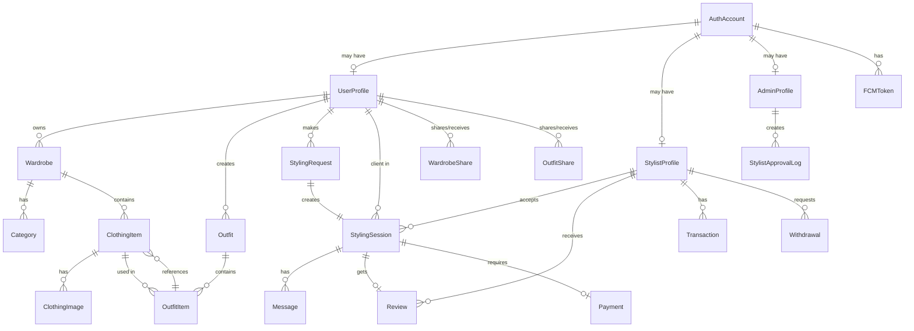

# 🏗️ VYBE DATABASE REDESIGN V2 - Role-Based Architecture

**Version:** 2.0 (Role-based with Admin & Approval System)
**Updated:** 2025-11-16
**Status:** Design Phase

---

## 🎯 New Requirements

1. ✅ **Single Role at Signup** → User chooses USER or STYLIST at registration
2. ✅ **Role Upgrade Workflow** → Stylist approval by system admin
3. ✅ **Admin System** → Separate admin login with approval dashboard
4. ✅ **Separate Apps** → User App vs Stylist App (same credentials)
5. ✅ **OAuth Integration** → Google & Apple Sign-In
6. ✅ **User Type Conversion** → Non-stylist can upgrade to stylist

---

## 📊 HIGH-LEVEL ARCHITECTURE

```
┌─────────────────────────────────────────────────────────────┐
│                    AUTH LAYER (OAuth)                       │
│        Google Sign-In | Apple Sign-In | Email/Password      │
└────────────────────────┬────────────────────────────────────┘
                         │
        ┌────────────────┼────────────────┐
        │                │                │
   ┌────▼────┐      ┌────▼────┐      ┌───▼────┐
   │ User    │      │ Stylist  │      │ Admin  │
   │  App    │      │   App    │      │ Panel  │
   └────┬────┘      └────┬────┘      └───┬────┘
        │                │                │
        └────────────────┼────────────────┘
                         │
        ┌────────────────▼────────────────┐
        │   UNIFIED DATABASE              │
        │  (Single source of truth)       │
        │                                 │
        │  ├─ Auth System                 │
        │  ├─ User Management             │
        │  ├─ Stylist Management          │
        │  ├─ Admin Management            │
        │  ├─ Wardrobe System             │
        │  ├─ Styling Marketplace         │
        │  └─ Payments                    │
        └─────────────────────────────────┘
```

---

## 🗂️ NEW MODELS NEEDED

### **NEW Domain 0: Authentication & Admin**

#### **Model 1: AuthAccount** (Unified Auth)
```
Purpose: Single source of truth for all logins
Supports: Email/Password, Google, Apple

Fields:
- id: UUID (PK)
- email: String (UNIQUE)
- password: String (nullable - null if OAuth)
- googleId: String (unique, nullable)
- appleId: String (unique, nullable)
- emailVerified: Boolean
- emailVerificationToken: String (nullable)
- isActive: Boolean (soft delete)
- createdAt: DateTime
- updatedAt: DateTime

Relationships:
- 1:1 → UserProfile
- 1:1 → AdminProfile
- 1:Many → FCMToken
```

#### **Model 2: UserProfile** (Basic User Info)
```
Purpose: General user account (non-stylist features)
When Created: On signup if user selects "User" role

Fields:
- id: UUID (PK)
- authAccountId: UUID (FK to AuthAccount, UNIQUE)
- firstName: String
- lastName: String
- phone: String (nullable)
- bio: String (nullable)
- avatar: String (nullable)
- totalFreeSessions: Int (default: 3)
- remainingFreeSessions: Int (default: 3)
- createdAt: DateTime
- updatedAt: DateTime

Relationships:
- 1:1 → AuthAccount
- 1:Many → Wardrobe (owns wardrobes)
- 1:Many → Outfit (creates outfits)
- 1:Many → StylingRequest (requests styling)
- 1:Many → WardrobeShare
- 1:Many → OutfitShare
```

#### **Model 3: StylistProfile** (Professional Styling Info)
```
Purpose: Stylist-specific data (created on demand after approval)
When Created: After admin approves stylist application

Fields:
- id: UUID (PK)
- authAccountId: UUID (FK to AuthAccount, UNIQUE)
- profileStatus: Enum (PENDING_APPROVAL, APPROVED, REJECTED, SUSPENDED)
- rejectionReason: String (nullable - why was application rejected)
- approvedAt: DateTime (nullable - when admin approved)
- rejectedAt: DateTime (nullable - when admin rejected)
- suspendedAt: DateTime (nullable - when suspended)
- suspensionReason: String (nullable)

Professional Info:
- yearsOfExperience: Int
- bio: String
- pricePerSession: Float
- languages: String[] (array)
- expertise: String[] (array)
- portfolioImages: String[] (array)

Stats:
- totalSessions: Int (default: 0)
- totalEarnings: Float (default: 0)
- averageRating: Float (default: 0)
- totalReviews: Int (default: 0)
- walletBalance: Float (default: 0)
- isAvailable: Boolean (default: true)

Relationships:
- 1:1 → AuthAccount
- 1:Many → StylingSession (as stylist)
- 1:Many → Review (receives reviews)
- 1:Many → Transaction (wallet history)
- 1:Many → Withdrawal (bank transfers)
```

#### **Model 4: AdminProfile** (Admin Users)
```
Purpose: System admin access and approvals
When Created: Created manually by super-admin

Fields:
- id: UUID (PK)
- authAccountId: UUID (FK to AuthAccount, UNIQUE)
- firstName: String
- lastName: String
- role: Enum (SUPER_ADMIN, ADMIN, MODERATOR)
- permissions: String[] (array - fine-grained perms)
- isActive: Boolean
- lastLoginAt: DateTime (nullable)
- createdAt: DateTime
- updatedAt: DateTime

Relationships:
- 1:1 → AuthAccount
- 1:Many → StylistApprovalLog (approves/rejects)
```

#### **Model 5: StylistApprovalLog** (Audit Trail)
```
Purpose: Track all stylist approval/rejection decisions

Fields:
- id: UUID (PK)
- stylistProfileId: UUID (FK to StylistProfile)
- adminId: UUID (FK to AdminProfile)
- action: Enum (SUBMITTED, APPROVED, REJECTED, SUSPENDED, UNSUSPENDED)
- previousStatus: Enum (previous status)
- newStatus: Enum (new status after action)
- reason: String (nullable - admin notes)
- notes: String (nullable - detailed feedback)
- createdAt: DateTime

Relationships:
- Many:1 → StylistProfile
- Many:1 → AdminProfile
```

#### **Model 6: UpgradeRequest** (User → Stylist Conversion)
```
Purpose: Track when non-stylist wants to become stylist

Fields:
- id: UUID (PK)
- authAccountId: UUID (FK to AuthAccount)
- status: Enum (SUBMITTED, REVIEWING, APPROVED, REJECTED)
- submittedAt: DateTime (when request created)
- yearsOfExperience: Int
- bio: String
- pricePerSession: Float
- languages: String[] (array)
- expertise: String[] (array)
- portfolioImages: String[] (array)
- approvedAt: DateTime (nullable)
- rejectedAt: DateTime (nullable)
- rejectionReason: String (nullable)
- createdAt: DateTime
- updatedAt: DateTime

Relationships:
- Many:1 → AuthAccount (the user applying)
```

---

## 🔄 USER FLOW WITH NEW SCHEMA

### **Flow 1: New User Signup (USER)**

```
┌──────────────────────────────────┐
│ User visits app & signs up       │
│ Chooses: "I want a wardrobe"     │
└──────────────┬───────────────────┘
               │
               ▼
┌──────────────────────────────────┐
│ System creates:                  │
│ 1. AuthAccount (email/password)  │
│ 2. UserProfile (basic info)      │
│ 3. FCMToken (push notifications) │
└──────────────┬───────────────────┘
               │
               ▼
┌──────────────────────────────────┐
│ User logs in via app             │
│ Can access:                      │
│ ✅ Wardrobe features             │
│ ✅ Outfit creation               │
│ ✅ Request styling from stylists │
│ ❌ Accept styling requests       │
│ ❌ Earn money                    │
└──────────────────────────────────┘
```

### **Flow 2: New Stylist Signup (STYLIST)**

```
┌──────────────────────────────────┐
│ Stylist visits app & signs up    │
│ Chooses: "I'm a stylist"         │
└──────────────┬───────────────────┘
               │
               ▼
┌──────────────────────────────────┐
│ System creates:                  │
│ 1. AuthAccount (email/password)  │
│ 2. StylistProfile                │
│    (status: PENDING_APPROVAL)    │
│ 3. UpgradeRequest (for audit)    │
│ 4. FCMToken (push notifications) │
└──────────────┬───────────────────┘
               │
               ▼
┌──────────────────────────────────┐
│ Admin notified: New stylist app  │
│ Admin reviews profile & decision │
└──────────────┬───────────────────┘
               │
      ┌────────┴────────┐
      │                 │
      ▼                 ▼
  ┌────────┐        ┌─────────┐
  │APPROVED│        │REJECTED │
  └────┬───┘        └────┬────┘
       │                 │
       ▼                 ▼
  Profile status:   Profile status:
  APPROVED          REJECTED

  Can accept       Cannot accept
  requests         requests

  Can earn         Cannot earn
  money            money
```

### **Flow 3: User Upgrades to Stylist**

```
┌──────────────────────────────────┐
│ Existing UserProfile user        │
│ Clicks: "Become a Stylist"       │
└──────────────┬───────────────────┘
               │
               ▼
┌──────────────────────────────────┐
│ System creates UpgradeRequest     │
│ User fills stylist info          │
│ (experience, languages, etc)     │
└──────────────┬───────────────────┘
               │
               ▼
┌──────────────────────────────────┐
│ System creates StylistProfile    │
│ (status: PENDING_APPROVAL)       │
└──────────────┬───────────────────┘
               │
               ▼
┌──────────────────────────────────┐
│ Admin reviews & approves         │
│ Creates StylistApprovalLog entry │
└──────────────┬───────────────────┘
               │
               ▼
┌──────────────────────────────────┐
│ StylistProfile.status = APPROVED │
│                                  │
│ Now user can:                    │
│ ✅ Still use wardrobe features   │
│ ✅ Accept styling requests       │
│ ✅ Earn money                    │
└──────────────────────────────────┘
```

---

## 🎭 ROLE DEFINITIONS

### **Role 1: Regular User**
- **AuthAccount + UserProfile (only)**
- **StylistProfile:** ❌ Does NOT exist
- **Can Do:**
  - Manage wardrobe & outfits
  - Request styling from stylists
  - Share wardrobe/outfits with friends
  - View stylist profiles & book sessions
- **Cannot Do:**
  - Accept styling requests
  - Earn money
  - Withdraw to bank

---

### **Role 2: Stylist (Approved)**
- **AuthAccount + StylistProfile (only)**
- **UserProfile:** ❌ Does NOT exist
- **StylistProfile.status:** ✅ APPROVED
- **Can Do:**
  - Accept styling requests
  - Conduct sessions
  - Earn money
  - Withdraw to bank
  - Have wallet
- **Cannot Do:**
  - Create personal wardrobe
  - Create outfits for themselves
  - Schedule outfits on calendar

---

### **Role 3: Dual-Role User**
- **AuthAccount + UserProfile + StylistProfile**
- **StylistProfile.status:** ✅ APPROVED
- **Can Do:**
  - Everything users can do
  - Everything stylists can do
  - Accept requests while using personal wardrobe
  - Earn money AND organize own closet

**Creation Path:**
1. User signs up as regular user
2. Later upgrades to stylist
3. Admin approves upgrade
4. Now has both profiles!

---

### **Role 4: Stylist (Pending Approval)**
- **AuthAccount + StylistProfile (only)**
- **StylistProfile.status:** ⏳ PENDING_APPROVAL
- **Can Do:**
  - View their profile
  - Edit profile info
  - See approval status
- **Cannot Do:**
  - Accept any requests (yet)
  - Earn money
  - Conduct sessions

---

### **Role 5: Admin**
- **AuthAccount + AdminProfile**
- **Can Do:**
  - View all stylist applications
  - Approve/reject applications
  - View all users/stylists
  - Manage admin settings
  - View transaction logs
  - Suspend stylists
  - View analytics

---

## 📱 SEPARATE APPS ARCHITECTURE

### **User App (iOS/Android/Web)**
```
Login Screen:
├─ Email/Password
├─ Google Sign-In
├─ Apple Sign-In
└─ Sign Up as User

Features Available:
├─ Wardrobe
│  ├─ Create wardrobes
│  ├─ Add items with photos
│  ├─ Organize by category
│  └─ Mark item status (AVAILABLE, LAUNDRY, etc)
│
├─ Outfit Creator
│  ├─ Create outfit combinations
│  ├─ Schedule on calendar
│  ├─ Share with friends
│  └─ Get suggestions
│
├─ Styling Requests
│  ├─ Browse stylists
│  ├─ Book immediate or scheduled session
│  ├─ Chat during session
│  └─ Leave reviews
│
└─ Settings
   ├─ Profile
   ├─ Notifications
   └─ Upgrade to Stylist (shows form)
```

### **Stylist App (iOS/Android/Web)**
```
Login Screen:
├─ Email/Password
├─ Google Sign-In
├─ Apple Sign-In
└─ Sign Up as Stylist

Features Available:
├─ Dashboard
│  ├─ Active requests
│  ├─ Earnings
│  └─ Ratings
│
├─ Requests
│  ├─ Browse incoming requests
│  ├─ Accept/reject
│  ├─ Set availability
│  └─ View history
│
├─ Sessions
│  ├─ Upcoming sessions
│  ├─ Chat with clients
│  ├─ View client wardrobes
│  └─ End session
│
├─ Wallet
│  ├─ View balance
│  ├─ Transaction history
│  ├─ Withdraw funds
│  └─ Bank account settings
│
├─ Profile
│  ├─ Stylist bio
│  ├─ Portfolio
│  ├─ Pricing
│  └─ Availability
│
└─ Reviews
   ├─ View ratings
   ├─ Read comments
   └─ Respond to reviews
```

### **Admin Dashboard (Web Only)**
```
Login Screen:
├─ Email/Password only (no OAuth)
└─ Super Admin creates accounts

Features:
├─ Stylist Applications
│  ├─ View all pending
│  ├─ Approve/Reject
│  ├─ View rejection history
│  └─ Manage suspensions
│
├─ Users
│  ├─ View all users
│  ├─ View transactions
│  └─ Manage accounts
│
├─ Analytics
│  ├─ Revenue reports
│  ├─ Session statistics
│  ├─ User growth
│  └─ Stylist performance
│
└─ Settings
   ├─ Platform fees
   ├─ Email templates
   └─ Admin accounts
```

---

## 🔐 Authentication Flow

```
┌─────────────────────────────────────────┐
│      SIGN UP / SIGN IN REQUEST          │
│  (Email/Password, Google, or Apple)     │
└──────────────┬────────────────────────┐─┘
               │                        │
        ┌──────▼──────┐        ┌───────▼────┐
        │ AuthAccount │        │ OAuth Check│
        │ exists?     │        │ valid token│
        └──────┬──────┘        └───────┬────┘
               │                       │
         ┌─────┴───────┬───────────────┴──────┐
         │             │                      │
      ┌──▼──┐      ┌───▼────┐            ┌───▼────┐
      │Login│      │ Create │            │ Create │
      │     │      │Account │            │Account │
      └──┬──┘      └───┬────┘            │ OAuth  │
         │             │                 └───┬────┘
         └─────────┬───┴──────────────────────┘
                   │
        ┌──────────▼──────────────┐
        │ Check which profile     │
        │ exists:                 │
        │ - UserProfile? → User   │
        │ - StylistProfile? →     │
        │   Check status          │
        │ - AdminProfile? → Admin │
        └──────────┬──────────────┘
                   │
         ┌─────────┴──────────┐
         │                    │
    ┌────▼────┐         ┌─────▼──────┐
    │ Return  │         │ If Stylist │
    │ User    │         │ PENDING?   │
    │ Token   │         │ → Limited  │
    └────────┘         │   access   │
                       └────────────┘
```

---

## 🔗 Key Relationships (Updated)

### **One AuthAccount Can Have:**
```
1:1 → UserProfile (if they're a user)
1:1 → StylistProfile (if they're a stylist)
1:1 → AdminProfile (if they're admin)

One of the above must exist!
```

### **Examples:**

**Regular User:**
```
AuthAccount
├─ email: "rahul@gmail.com"
├─ googleId: "1234567890"
└─ UserProfile (linked)
   ├─ firstName: "Rahul"
   └─ wardrobes: 2
```

**Stylist (Approved):**
```
AuthAccount
├─ email: "priya@gmail.com"
├─ appleId: "987654321"
└─ StylistProfile (linked)
   ├─ status: "APPROVED"
   ├─ walletBalance: 15000
   └─ totalSessions: 45
```

**Dual-Role User:**
```
AuthAccount
├─ email: "ananya@gmail.com"
├─ password: "hashed"
├─ UserProfile (linked)
│  ├─ wardrobes: 3
│  └─ outfits: 12
└─ StylistProfile (linked)
   ├─ status: "APPROVED"
   ├─ walletBalance: 8000
   └─ totalSessions: 30
```

---

## 🚀 Migration Path (if converting from V1)

```
V1 (Current):
User {
  id: UUID
  email: String
  role: "USER" | "STYLIST"
  ...
}

StylistProfile {
  userId: UUID
  ...
}

V2 (New):
AuthAccount {
  id: UUID
  email: String
  ...
}

UserProfile {
  authAccountId: UUID
  ...
}

StylistProfile {
  authAccountId: UUID
  status: "PENDING_APPROVAL"
  ...
}
```

**Migration SQL:**
```sql
-- Step 1: Create new tables
CREATE TABLE AuthAccount (...)
CREATE TABLE UserProfile (...)
CREATE TABLE StylistProfile_v2 (...)
CREATE TABLE StylistApprovalLog (...)

-- Step 2: Copy data
INSERT INTO AuthAccount (email, password, googleId, appleId, ...)
SELECT email, password, googleId, appleId, ... FROM User

INSERT INTO UserProfile (authAccountId, ...)
SELECT aa.id, ... FROM User u
JOIN AuthAccount aa ON u.email = aa.email
WHERE u.role = 'USER'

INSERT INTO StylistProfile_v2 (authAccountId, ...)
SELECT aa.id, ... FROM User u
JOIN StylistProfile sp ON u.id = sp.userId
JOIN AuthAccount aa ON u.email = aa.email
```

---

## 🎯 Query Examples

**Get all approved stylists:**
```sql
SELECT * FROM StylistProfile
WHERE status = 'APPROVED'
```

**Get pending stylist applications:**
```sql
SELECT sp.*, aa.email
FROM StylistProfile sp
JOIN AuthAccount aa ON sp.authAccountId = aa.id
WHERE sp.status = 'PENDING_APPROVAL'
ORDER BY sp.createdAt DESC
```

**Get dual-role users:**
```sql
SELECT aa.*, up.*, sp.*
FROM AuthAccount aa
JOIN UserProfile up ON aa.id = up.authAccountId
JOIN StylistProfile sp ON aa.id = sp.authAccountId
WHERE sp.status = 'APPROVED'
```

**Get stylist earnings:**
```sql
SELECT sp.id, aa.email, sp.totalEarnings, sp.walletBalance
FROM StylistProfile sp
JOIN AuthAccount aa ON sp.authAccountId = aa.id
WHERE sp.status = 'APPROVED'
ORDER BY sp.totalEarnings DESC
```

---

## 📊 Updated ER Diagram



---

## ✅ Implementation Checklist

- [ ] Create AuthAccount table
- [ ] Create UserProfile table
- [ ] Create AdminProfile table
- [ ] Create StylistProfile (with status field)
- [ ] Create StylistApprovalLog table
- [ ] Create UpgradeRequest table
- [ ] Update FCMToken to reference AuthAccount
- [ ] Update other tables to reference AuthAccount/UserProfile
- [ ] Create approval workflow API endpoints
- [ ] Create admin dashboard backend
- [ ] Implement OAuth integration
- [ ] Create role-based access control
- [ ] Set up email notifications for approvals
- [ ] Create migration scripts for V1 → V2

---

This redesign gives you:
✅ Clear role separation
✅ Approval workflow for stylists
✅ Admin management system
✅ Separate apps with same credentials
✅ OAuth support
✅ Audit trails for all decisions
✅ Flexible upgrading from user to stylist
